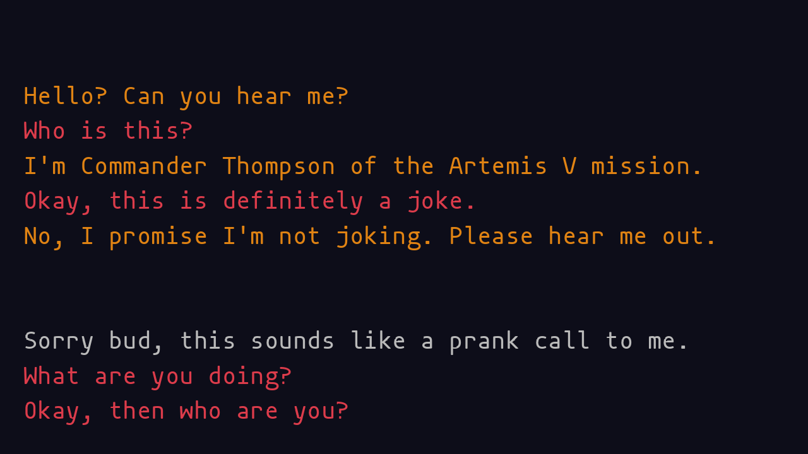

# Space Call

Author: Eric Schneider

Design: I made a nice little text adventure engine that is able to read simple branching narratives from a text file and render them at runtime. However, I ran out of time before I could make a long text adventure for it :(

Text Drawing: I use harfbuzz to do spacing and freetype to generate glyphs. First, I run the entire script through harfbuzz to generate a list of glpyhs that are used by the text adventure. Then, using freetype and glTexSubImage2D, I map all the glyphs onto a single texture atlas, storing their location in said atlas. Then, when the game needs to render a string, it can still shape the glyphs using harfbuzz, but it will be able to take the glyphs immediately off of the texture that I use.

Screen Shot:

How To Play:

Options show up at the bottom of the screen. Click 'em!

Sources: The font I used is the incredible [mononoki](https://madmalik.github.io/mononoki/), licensed under the SIL Open Font License 1.1. I chose monospace for stylistic reasons--the software should work with any font.

This game was built with [NEST](NEST.md).

